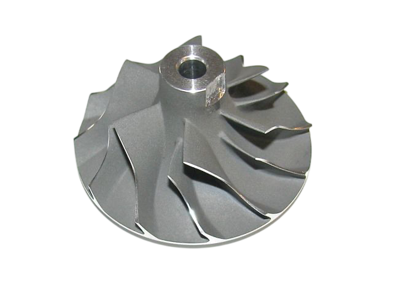

<!-- PROJECT TITLE & BADGE -->
# RC Turbojet Engine Made in Sri Lanka

We fabricated a functional RC turbojet engine in Sri Lanka using cost-effective, locally available materials ✈️. Prioritizing functionality over weight, we first test with affordable materials before transitioning to aerospace-grade ones. This project showcases innovation🔥, adaptability, and engineering excellence with limited resources!🌍

---

## Table of Contents
This README provides a comprehensive guide to the design, manufacturing, technical decisions and challenges encounted throughout our RC turbojet engine project. Use the links below to quickly navigate to each section:

- [Project Overview](#project-overview)
- [Design Decisions](#design-decisions)
   - [Compressor](#compressor)
   - [Stator](#stator)
   - [Vaneless vs. Bladed Stators](#vaneless-vs-bladed-stators)
   - [Shaft](#shaft)
   - [Turbo Guided Vanes (Nozzle Guide Vanes)](#turbo-guided-vanes)
   - [NGV Aerodynamic and Geometry Considerations](#aerodynamic-and-geometry-considerations)
   - [NGV Fabrication Process](#our-ngv-fabrication-process)
   - [Turbine](#turbine)
   - [Combustion C hamber](#combustion-chamber)
   - [Compressor Shroud](#compressor-shroud)
- [Dimensions Chart](#dimensions-chart)
- [Material Consideration](#material-consideration)

---

## Design Decisions

### Compressor
The compressor is a critical component, as it drives the entire system based on its compression ratio(**reference). This is why our initial focus was on selecting and sourcing the right compressor for the project.
The initial decision regarding the size of our turbojet engine was driven by the availability and practicality of sourcing a suitable compressor. For RC turbojet engines, a centrifugal compressor is essential. 

Manufacturing a custom compressor to our exact requirements would have required advanced 4-axis milling, with costs approaching LKR 50,000—making it impractical for our budget.

As an alternative, we considered using car turbocharger compressors(**reference), which are well-suited for this application. However, purchasing a brand-new turbocharger compressor would still cost around LKR 12,000. To further reduce costs, we visited compressor repair centers and sourced defective turbochargers that were discarded due to faults in other components, while the compressor section remained in good condition. This strategy enabled us to acquire the necessary compressor at a fraction of the market price, ensuring both affordability and functionality for our project.

---

### Stator
### Essential Features of the Stator
- **Divergent Geometry:** Internal passages must be divergent (widening) to slow down the high-velocity air leaving the impeller and convert kinetic energy into static pressure.
- **Vane Placement and Gap:** Diffuser vanes should not start immediately at the impeller edge. A vaneless annular space (typically 1.15 to 1.2 times the wheel diameter) between the rotor and stator blades helps even out airflow.
- **Alignment and Angles:** The inner edges of the vanes must be perfectly aligned with the direction of airflow leaving the impeller. Even a few degrees of misalignment can prevent the engine from running. For a 66mm model rotor, an outflow angle of about 19–21 degrees is common.
- **Expansion Angle:** To prevent airflow separation and losses, the expansion angle between adjacent vanes should generally be 8–10 degrees. Slightly larger angles may be tolerated in model engines, but exceeding this range reduces efficiency.
- **Clearance Control:** The clearance between the rotating impeller and the static casing/diffuser should be minimal to prevent air leakage, but not so small as to cause aerodynamic buffeting and vibration.

Manufacturing the stator with the ideal features presents significant cost and technical challenges. We considered the following manufacturing techniques:

1. **4-Axis Milling:** Integrating vanes directly into the stator using 4-axis milling, which would cost around LKR 40,000 for the entire system.
2. **Lathe with Separate Vanes:** Machining the main stator body on a lathe and then attaching vanes separately.
3. **Lathe Only (No Vanes):** Fabricating the stator entirely on a lathe without adding vanes.

[text](https://share.google/vIEyuUOXTUau4Db4e)

Due to cost constraints, only options 2 and 3 were feasible. However, given the small size of the system, manufacturing and attaching separate vanes (option 2) was impractical. As a result, we chose option 3—making the stator using a lathe without vanes. 

#### Trade-offs Between Vaneless and Bladed Stators
The choice between using vanes or a vaneless space involves a trade-off between manufacturing simplicity and engine size:

**Advantages of a Vaneless Design:**
- **Simplicity:** Much easier to manufacture than a system requiring precisely angled blades.
- **Regulatory Stability:** Outstanding regulatory characteristics, as there are no blades that can cause flow breakaway if the angles are calculated incorrectly.
- **Turbocharger Application:** Vaneless nozzles are often used in turbochargers, where efficiency is less critical due to excess exhaust energy.

**Disadvantages of a Vaneless Design:**
- **Size Constraints:** Achieving sensible efficiency without vanes requires the engine diameter to be at least twice the diameter of the compressor wheel.
- **Residual Swirl:** Vaneless diffusers cannot easily eliminate the twisting motion of gases, leading to pressure drops as the gas moves toward the engine center.

**Conclusion from the Sources:**
A bladed diffuser is considered the best solution for a model jet engine, allowing for a compact frontal area and higher pressure conversion. However, sources confirm that a vaneless system is a functional alternative for those prioritizing ease of construction over maximum performance.
The decision to omit stator vanes was based on references indicating that bladeless (vaneless) stator systems are suitable when simplicity is required and when testing basic system functionality is the priority. This approach allowed us to minimize design complexity and focus on essential performance.

---

---

**Analogy:**
A vaneless stator is like a wide, open field that eventually lets cars slow down and turn, but it requires a massive amount of land. A bladed stator is like a tightly curved, concrete-walled ramp; it takes up very little space and directs traffic perfectly, but if the walls are built at the wrong angle, the cars will crash.

## Shaft
The shaft design strictly followed official reference dimensions, as these have already undergone intense design considerations for load balance, mechanical strength, and high-speed stability. We did not make any major changes, ensuring the shaft would reliably withstand the demanding conditions of turbojet operation.

**Summary of Design Considerations:**
Designing an engine shaft requires careful attention to mechanical strength, rotational stability, and thermal management. The reference design addresses:
- **Structural and Mechanical Requirements:** Efficient energy transfer, management of axial loads, and secure coupling/alignment.
- **Dynamics and Vibration Control:** Avoidance of resonance, maintaining a safe margin above critical speed, and optimal shaft proportions for rigidity.
- **Material Selection:** Use of heat-treated steel for toughness, avoiding materials like titanium and stainless steel for reliability and heat dissipation.
- **Precision Machining and Bearings:** Extreme accuracy in machining, robust bearing support, and accommodation for differential thermal expansion.

By adhering to these proven reference dimensions, we made only minimal changes—primarily to ensure proper fitment with the compressor. For manufacturing, we selected high-carbon steel, which allowed for precise machining of the shaft's tiny details. The entire process, performed on a lathe over a full day, was time-consuming due to the small dimensions and required accuracy.

## Turbo Guided vanes
## Aerodynamic and Geometry Considerations
The aerodynamic shape and geometry of the nozzle guide vanes (NGV) are crucial for efficient energy transfer in a turbojet engine. The vanes serve as stationary nozzles, converting the pressure energy of hot combustion gases into high-velocity jets that drive the turbine rotor. Key aerodynamic and geometric considerations include:

- **Energy Conversion:** NGVs accelerate combustion gases by forming convergent passages between adjacent vanes, increasing gas velocity to near sonic speeds (up to ~2,500 ft/s in full-sized engines).
- **Directional Flow (Whirl):** The vanes impart a specific spin or whirl to the gas, matching the direction of turbine rotation. This maximizes the energy transferred to the rotor blades.
- **Blade Twist:** The vanes are twisted, with a greater stagger angle at the tip than at the root. This ensures the gas flow does equal work along the entire blade and exits with uniform axial velocity.
- **Vane Count:** To prevent aerodynamic oscillations, the number of vanes should not share a common divisor with the number of rotor blades (e.g., 11 vanes for 19, 21, or 23 rotor blades).
- **Overlap and Flow Control:** When viewed from the front, vanes should overlap as much as possible, preventing a straight line of sight through the NGV. This ensures the gas is properly directed and reduces losses.

In summary, careful attention to NGV geometry—including convergent duct design, controlled whirl, blade twist, and vane count—ensures that combustion gases are efficiently accelerated and precisely directed onto the turbine, maximizing both performance and stability.

### Our NGV Fabrication Process
To fabricate the nozzle guide vanes (NGV) for our engine, we followed a step-by-step process focused on precision and aerodynamic requirements:

1. **Core Preparation:**
   - We first designed and machined the NGV core to ensure a precise fit with both the shaft casing and the shaft itself.

2. **Vane Material and Cutting:**
   - Using 1.2mm stainless steel, we laser-cut rectangular strips to match the required vane height from the core.
   - These strips were then further divided into smaller rectangles, each forming an individual vane.

3. **Vane Shaping:**
   - Each small rectangle was carefully bent to achieve the correct aerodynamic profile, mimicking the twist and divergence found in actual turbine vanes. This step was time-consuming, as it required each vane to be shaped like a miniature wing to ensure proper gas flow.

4. **Assembly and Welding:**
   - The shaped vanes were positioned on the core to create convergent passages between adjacent vanes, ensuring the gas would be accelerated and directed as required.
   - We used TIG welding to attach each vane to the core, taking care to maintain the correct orientation: vanes were set to direct flow perpendicular to the turbine vanes and to overlap as much as possible when viewed from the front.

This hands-on fabrication approach allowed us to meet the main aerodynamic requirements for NGVs, despite the challenges of working with small, precise components and manual assembly.

## Turbine

According to Thomas Kamps and related sources, there are two main approaches to manufacturing turbine rotors for model jet engines:

### Sheet Metal (Kamps Method) for home builders.
- **Material:** Typically uses 6 mm thick high-grade stainless steel (such as 316, V4A, or INOX). Industrial alloys like Inconel are preferred for higher thrust, but stainless steel is suitable for moderate thrust (~40 N).
- **Cutting:** The turbine disc is cut from a metal sheet—either by water jet for precision or manually with a hacksaw for home builds.
- **Blade Formation:** Slots are cut for the blades, which are then heated and twisted (about 30–35°) to form the correct angle using pliers or a custom tool.
- **Finishing:** Blades are ground and sanded to achieve an aerodynamic, cambered profile, with a rounded inlet and pointed outlet.

### Industrial Manufacturing (Casting)
- **Investment Casting:** Uses the lost wax process to create complex, high-performance turbine rotors with internal cooling passages and excellent surface finish.
- **Advanced Techniques:** For maximum durability, blades may be made with Directional Solidification or as Single Crystals to resist heat-induced deformation (creep).

### Our Turbine Fabrication Approach
Instead of fabricating the turbine from sheet metal or casting, we repurposed an undamaged turbine from an old car turbocharger. This approach provided a component made from a material capable of withstanding very high temperatures, which is essential for this part of the engine. To adapt the turbocharger turbine for our use and reduce its weight, we cut away a portion of its cross-section. This method offered several advantages but also presented unique challenges:

1. **Material Hardness and Cutting:**
   - The used turbocharger turbine had already experienced multiple heat, cooling, and stress cycles, making the material extremely hard. Cutting the cross-section precisely was difficult and time-consuming, requiring significant effort to achieve the desired shape. After cutting, additional time was spent polishing and smoothing the surface and also we have to be caution that not to break any vanes. 

2. **Machining the Shaft Hole:**
   - Drilling a hole for the shaft was particularly challenging due to the hardened material. We had to use several drill bits, including a high-quality diamond bit, to complete the process. The hole was finished on a lathe to ensure accuracy and minimize the risk of vibration from uneven material.

This method allowed us to utilize a high-temperature-resistant material while overcoming the difficulties of machining a previously used and hardened turbine component.

> **Safety Note:**
> When working with a reused turbocharger turbine, extra caution is required. The material's increased hardness from previous heat and stress cycles can make it more brittle and susceptible to cracking or failure during modification or operation. Always prioritize safety and thoroughly inspect the component before and after machining to minimize risks.

## Combustion Chamber

## Compressor Shroud
The compressor shroud (or compressor cover) is a vital component that directly impacts engine efficiency, reliability, and safety. Its design and manufacture require careful attention to several key factors:

### 1. Aerodynamic and Dimensional Considerations
- **Tip Clearance Management:** Maintain the smallest possible gap (ideally ~0.3 mm in model engines) between the impeller blade tips and the shroud wall to minimize air leakage and maximize efficiency.
- **Constant Gap Geometry:** Ensure a uniform gap along the entire blade length by precisely matching the shroud’s internal profile to the inducer and exducer curvatures of the compressor wheel. *(Image recommended for clarity)*
- **Flow Induction:** Design the shroud to provide even air distribution at the inlet, avoiding disruptions or excessive gaps that could reduce efficiency or cause overheating.

### 2. Structural and Material Considerations
- **Rigidity and Weight:** The shroud must be lightweight yet rigid to maintain precise clearances at high speeds.
- **Material Selection:**
   - *Aluminium* is standard for compressor shrouds due to its light weight and suitability for cooler engine sections.
   - *Magnesium* and *composites* are used in advanced engines for further weight reduction and noise suppression.
   - *Titanium* offers high rigidity but is generally avoided in rubbing areas due to fire risk from frictional heating.
- **Thermal Expansion:** Account for different expansion rates between the compressor wheel and shroud, ensuring clearances are optimal both cold and hot.

### 3. Manufacturing and Integration
- **Precision Machining:** Achieving the required internal profile and tight tolerances often necessitates 5-axis CNC milling, as manual machining is challenging at these scales.
- **Alignment and Sealing:** The shroud must be perfectly aligned with the diffuser, typically attached with self-locking fasteners. Joints are sealed with teflon tape or oil-swelling rubber bands to prevent leaks.

### Our Manufacturing Approach
Due to the high cost of 5-axis milling, we considered both casting and lathe machining from raw material. However, casting services for such small components were unavailable. As a result, we used a lathe, which required removing a significant amount of material to achieve the desired shroud shape. This process was time-consuming, especially for smoothing and finishing. Based on our experience, we recommend casting over subtractive manufacturing when possible, as it is more material- and time-efficient for this shape. 

# Dimensions chart 

# Material Consideration

